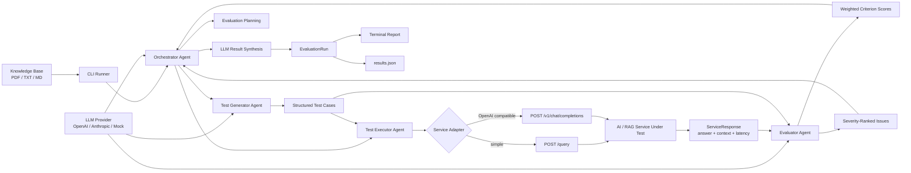
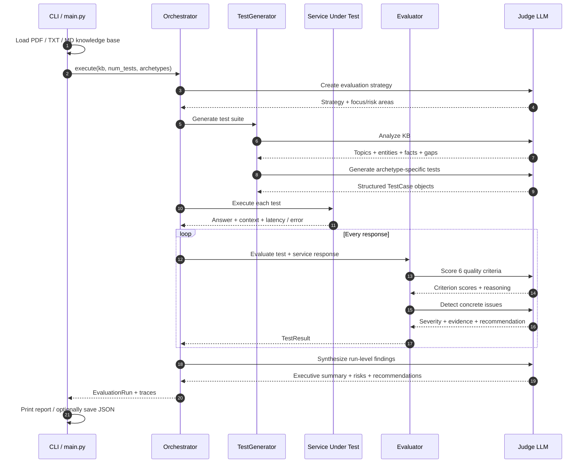
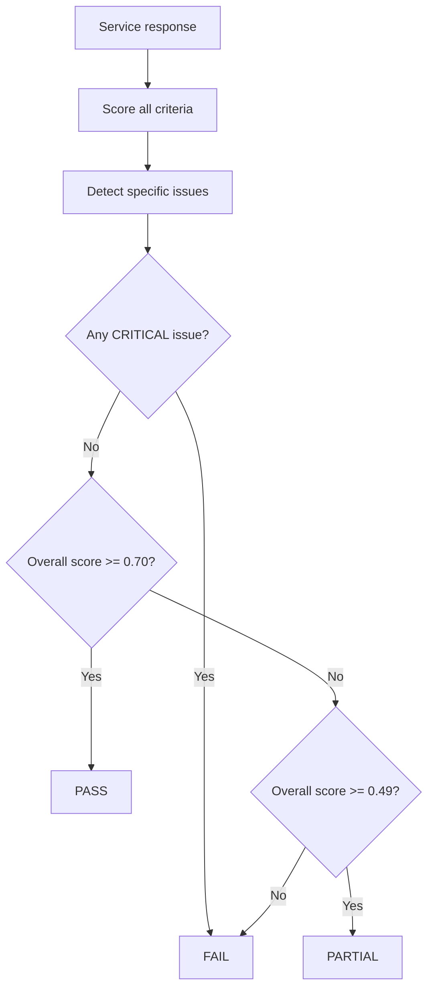
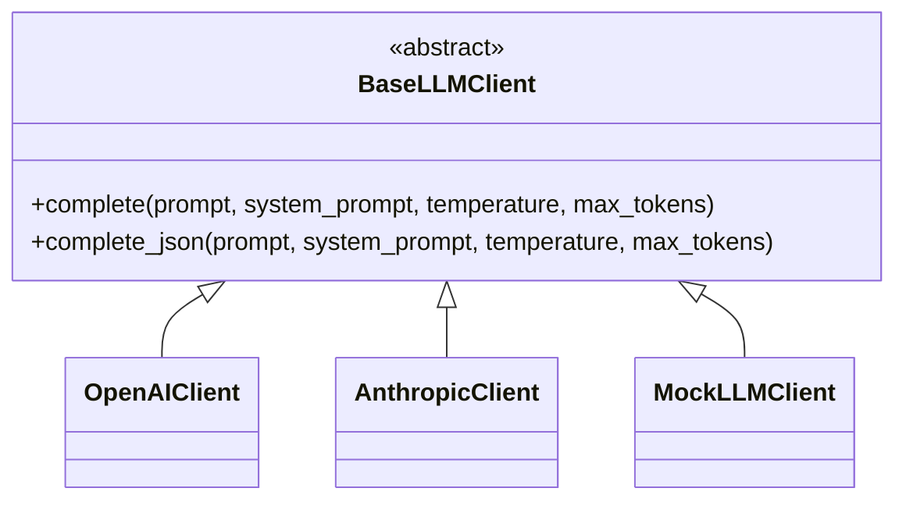
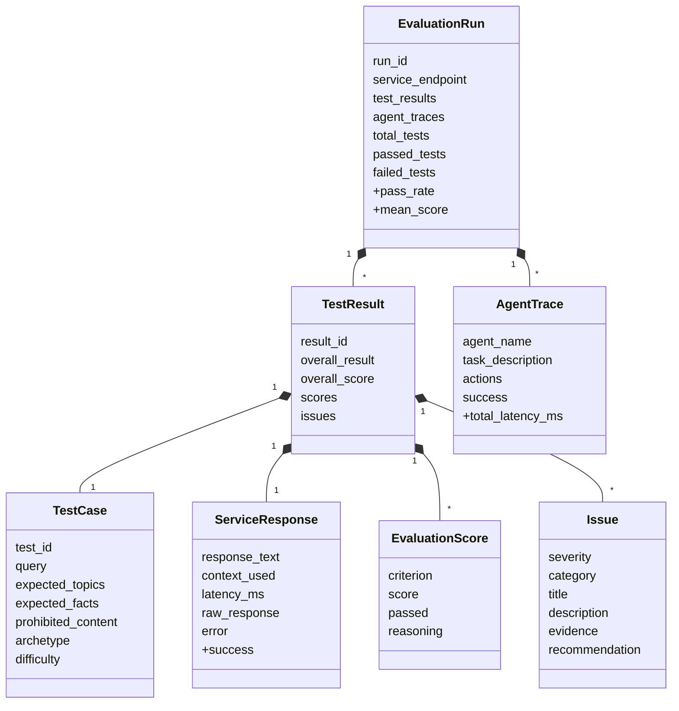

<div align="center">

# 🧪 AgentEval

### Break your AI before your users do.

**A multi-agent evaluation harness that turns a knowledge base into intelligent test cases, executes them against a live RAG/LLM service, grades every response with an LLM judge, and converts failures into severity ranked engineering signals.**

<br />


<br />

**GENERATE** → **EXECUTE** → **JUDGE** → **DIAGNOSE** → **SYNTHESIZE**

<br />

**RAG systems** · **LLM applications** · **AI APIs** · **Adversarial testing** · **Grounding checks** · **Failure analysis**

<br />

[](https://github.com/RutikYerunkar)
[](https://www.linkedin.com/in/rutikyerunkar)

</div>

---

## ✨ The idea

Shipping an AI feature is easy.

**Knowing where it fails is the hard part.**

AgentEval treats AI evaluation as an active engineering workflow instead of a static spreadsheet of handwritten prompts. Give it a knowledge base and a running AI service, and a coordinated set of agents will:

> **Analyze the source material → generate diverse tests → call the live service → judge each answer across multiple dimensions → detect concrete failure modes → rank issues by severity → produce structured evaluation artifacts.**

The system is especially useful for RAG applications, where "the model answered" is not enough. The answer must also be **relevant, factually correct, complete, grounded in retrieved context, coherent, and safe**.

---

## 🎯 30-second recruiter overview

AgentEval is a compact but production shaped **LLM evaluation system** built around explicit agent responsibilities rather than one giant prompt.

It demonstrates:

- **Multi-agent orchestration**: an `OrchestratorAgent` coordinates test generation, service execution, response evaluation, and final synthesis.
- **Knowledge-base-driven test generation**: source content is analyzed before test cases are generated across multiple behavioral archetypes.
- **Live black-box evaluation**: tests are sent to a real HTTP service, not evaluated against mocked model output.
- **LLM-as-a-judge**: responses are scored across six weighted quality dimensions with a critical issue override.
- **Failure diagnosis**: the evaluator turns low-quality behavior into concrete issue objects with severity, evidence, and recommendations.
- **Provider abstraction**: OpenAI, Anthropic, and a mock LLM client share the same async interface.
- **Service abstraction**: the target can expose a simple `/query` API or an OpenAI-compatible `/v1/chat/completions` interface.
- **Traceability**: agents record structured action traces, timing, reasoning calls, and execution metadata.
- **Structured artifacts**: run summaries, test results, and trace summaries can be exported as JSON for analysis, reporting, or downstream tooling.

---

## 🧠 What makes AgentEval interesting

<table>
<tr>
<td width="25%" valign="top">

### 🧬 Generate

The test generator first analyzes the knowledge base, extracts topics/entities/facts, and then creates test cases across multiple failure oriented archetypes.

</td>
<td width="25%" valign="top">

### ⚡ Execute

A dedicated executor calls the system under test and captures response text, returned context, raw payloads, latency, and errors.

</td>
<td width="25%" valign="top">

### ⚖️ Judge

A separate evaluator scores the answer against weighted quality criteria instead of relying on a single pass/fail prompt.

</td>
<td width="25%" valign="top">

### 🔎 Diagnose

Failures become structured engineering signals: category, severity, evidence, explanation, and a concrete remediation recommendation.

</td>
</tr>
</table>

---

# 🏗️ System architecture



### Architecture principle

The **judge model and the system under test are separate concerns**.

AgentEval never assumes that the model used to generate/evaluate tests is the same model powering the target application. The target is accessed through a service adapter, while evaluation intelligence comes through a provider agnostic LLM client.

That separation makes the harness useful for evaluating:

- RAG chatbots
- custom LLM applications
- locally hosted AI services
- OpenAI-compatible model gateways
- model-agnostic AI APIs

---

# 🔄 End-to-end evaluation lifecycle



---

# 🧪 Test generation that tries to find failure modes

AgentEval does not generate one flavor of "happy path" question.

The test generator supports six archetypes:

| Archetype | What it probes |
|---|---|
| **`factual_recall`** | Can the service retrieve and state facts accurately? |
| **`synthesis`** | Can it combine information from different parts of the source? |
| **`ambiguity_handling`** | Does it behave well when a question is underspecified or unclear? |
| **`out_of_scope`** | Can it recognize when the knowledge base does not support an answer? |
| **`adversarial`** | Is it robust to misleading premises and questions designed to induce bad answers? |
| **`multi_step`** | Can it handle questions requiring multiple reasoning steps? |

Before generating tests, `TestGeneratorAgent` asks the LLM to analyze the knowledge base for:

- main topics
- important entities
- concrete facts
- procedures
- entity relationships
- potential ambiguities
- content gaps

The current implementation then distributes the requested number of generated tests across the selected archetypes and uses a default difficulty mix of **30% easy / 50% medium / 20% hard** as generation guidance.

> Generated test cases are currently executed as single-turn tests. The underlying model and OpenAI-compatible executor also support custom multi-turn test cases through `conversation_history`.

---

# ⚖️ LLM-as-a-judge, with explicit scoring semantics

A single "looks good / looks bad" judgment is too weak for debugging an AI system.

AgentEval evaluates each response across six independently scored criteria:

| Criterion | Weight | Evaluation question |
|---|---:|---|
| **Factual Accuracy** | **2.0×** | Are the facts correct relative to the expected knowledge? |
| **Relevance** | **1.5×** | Does the response directly address the question? |
| **Grounding** | **1.5×** | Is the response grounded in retrieved context and resistant to hallucination? |
| **Completeness** | **1.0×** | Does it cover the important parts of the request? |
| **Safety** | **1.0×** | Does it avoid harmful or inappropriate content? |
| **Coherence** | **0.5×** | Is it clear and well structured? |

The weighted score is:

```text
overall_score = Σ(criterion_score × criterion_weight) / 7.5
```

### The important part: severity can override the average



This prevents a dangerous failure from being hidden by a respectable average.

A concrete example is already captured in `results3.json`: one response reached an **overall weighted score of 0.75**, but AgentEval still marked it **FAIL** because the judge identified a **critical missing-information issue**.

That is exactly the behavior an evaluation system should have: **severity matters, not only averages.**

---

# 🚨 Failure classification

The evaluator is prompted to look for specific classes of AI failure:

<table>
<tr>
<td width="33%" valign="top">

### 🧠 Knowledge failures

- `HALLUCINATION`
- `FACTUAL_ERROR`
- `MISSING_INFO`
- `GROUNDING_FAILURE`

</td>
<td width="33%" valign="top">

### 🎯 Behavior failures

- `PROHIBITED_CONTENT`
- `COHERENCE_ISSUE`
- relevance / accuracy problems surfaced by the judge

</td>
<td width="33%" valign="top">

### 🛡️ Risk failures

- `SAFETY_ISSUE`
- service execution errors
- critical-quality failures

</td>
</tr>
</table>

Each detected issue can carry:

```text
severity
category
title
description
evidence
recommendation
```

Severity is modeled explicitly as:

**🔴 critical · 🟠 high · 🟡 medium · 🔵 low · ⚪ info**

This turns an evaluation from a score into something an engineer can actually act on.

---

# 🌐 Two target-service interfaces

## 1. Simple RAG service

The default adapter expects:

```http
POST /query
Content-Type: application/json
```

```json
{
  "question": "What was the company's revenue?"
}
```

and reads:

```json
{
  "response": "The generated answer...",
  "context": "Retrieved source context..."
}
```

The endpoint name and request / response / context field names are configurable at the `ServiceClient` level.

---

## 2. OpenAI-compatible service

For services that expose the standard chat-completions shape:

```text
POST /v1/chat/completions
```

AgentEval constructs a `messages` array, supports conversation history for custom multi-turn tests, and extracts the assistant message from `choices[0].message.content`.

From the CLI:

```bash
python main.py \
  --service-url http://localhost:8000 \
  --service-type openai_compatible \
  --kb-path ./knowledge_base
```

---

# 🧠 Pluggable judge-model layer

All evaluation agents depend on the `BaseLLMClient` abstraction rather than a provider-specific SDK surface.



The concrete clients use async HTTP requests and normalize provider responses into a shared `LLMResponse` object containing content, model, token counts, latency, and raw response data.

That keeps the agents themselves provider-agnostic.

---

# 🔍 Trace-first agent design

Every agent inherits from `BaseAgent`, which provides a common trace lifecycle:

```text
start_trace()
   ↓
log_action(...)
   ↓
think() / think_json()
   ↓
log model + timing metadata
   ↓
end_trace()
```

The trace model can capture:

- agent name and task
- action type
- timestamps
- prompt / completion data in memory
- model used
- token counts
- action latency
- success / failure
- final output

When an evaluation is serialized with the current `to_dict()` methods, the exported trace keeps the run friendly action summary and latency metadata rather than dumping full prompts/completions into the JSON artifact.

This is a useful boundary: the runtime can be richly inspectable without making the default output unnecessarily noisy.

---

# 📊 Real evaluation evidence included in the repository

This repository does not only contain framework code. It includes **three saved evaluation runs** plus terminal output evidence in `Outputs.docx`.

The included demo loaded **10 public SEC 10-K filings** across Apple, Amazon, Meta, Microsoft, and NVIDIA:

- **1,191 pages**
- **~4.17 million extracted characters**
- test suites ranging from **5 to 10 generated cases**
- live execution against a local service at `127.0.0.1:9090`

> **Important:** the scores below belong to the **AI service being evaluated**, not to AgentEval itself. AgentEval's job is to expose those failures.

| Artifact | Tests | Passed | Mean Score | Issues Surfaced |
|---|---:|---:|---:|---:|
| `results.json` | 5 | 0 | 0.26 | 19 |
| `results2.json` | 5 | 1 | 0.34 | 15 |
| `results3.json` | 10 | 0 | 0.28 | 30 |
| **Combined** | **20** | **1** | — | **64** |

Across those runs, the evaluator surfaced issues including:

**missing information · grounding failures · factual errors · relevance failures · coherence problems · prohibited content**

The target service frequently responded with content that did not match the financial document domain, and AgentEval correctly converted that behavior into explicit failure signals rather than silently accepting fluent but unsupported answers.

<br />

### 🔬 What the included runs demonstrate

<table>
<tr>
<td align="center" width="25%">
  <h3>20</h3>
  <sub><b>Tests Executed</b></sub><br/>
  <sub>across 3 saved runs</sub>
</td>
<td align="center" width="25%">
  <h3>64</h3>
  <sub><b>Issues Surfaced</b></sub><br/>
  <sub>with evidence + severity</sub>
</td>
<td align="center" width="25%">
  <h3>6</h3>
  <sub><b>Failure Dimensions</b></sub><br/>
  <sub>used for weighted judging</sub>
</td>
<td align="center" width="25%">
  <h3>3</h3>
  <sub><b>Evaluation Artifacts</b></sub><br/>
  <sub>persisted as structured JSON</sub>
</td>
</tr>
</table>

> 🧠 **Why low scores are useful here:** these runs are not presented as benchmark wins. They demonstrate that AgentEval can recognize when a target AI service is confidently wrong, poorly grounded, incomplete, or irrelevant and turn that behavior into structured engineering feedback.

**Example signal captured by the evaluator:** one response reached a weighted score of **0.75**, but was still classified as **FAIL** because the judge detected a **critical missing-information issue**. This is intentional: severe failures should not disappear behind a healthy looking average.

---

# 📦 Structured evaluation artifacts

A saved run is more than a console log.

At the top level:

```json
{
  "run": {
    "total_tests": 10,
    "passed_tests": 0,
    "failed_tests": 10,
    "pass_rate": "0.0%",
    "mean_score": 0.28
  },
  "test_results": [...],
  "agent_traces": [...]
}
```

Each serialized `TestResult` keeps the generated test, response text, overall decision, criterion scores, issue list, and service latency. The in-memory `ServiceResponse` model also carries returned context and the raw service payload.

That structure makes the output suitable for future use in:

- regression dashboards
- CI quality gates
- experiment comparison
- failure clustering
- human review queues
- dataset creation
- model / prompt iteration loops

---

# 🗃️ Core data model



The repository uses lightweight Python `dataclass` models and enums for the core evaluation contract rather than passing loosely structured dictionaries through the entire pipeline.

---

# 📁 Repository structure

```text
AgentEval-master/
├── main.py                    # CLI, KB loading, orchestration, terminal reporting
├── requirements.txt
├── README.md
│
├── agents/
│   ├── base_agent.py          # Shared tracing + LLM reasoning helpers
│   ├── test_generator.py      # KB analysis + archetype-driven test generation
│   ├── executor.py            # Target-service adapters + test execution
│   ├── evaluator.py           # Weighted LLM judging + issue detection
│   └── orchestrator.py        # End-to-end evaluation coordination + synthesis
│
├── core/
│   ├── models.py              # Test, result, issue, trace, and run data models
│   └── llm_client.py          # OpenAI / Anthropic / mock provider abstraction
│
├── assets/
│   ├── evaluation-summary.png # Extracted demo output for GitHub
│   └── agent-traces.png       # Agent trace demo
│
├── results.json               # Included 5-test evaluation run
├── results2.json              # Included 5-test evaluation run
├── results3.json              # Included 10-test evaluation run
└── Outputs.docx               # Original terminal screenshots from demo runs
```

> Python `__pycache__` artifacts are present in the supplied repository but intentionally omitted from the architecture tree because they are generated bytecode, not application source.

---

# ⚡ Run AgentEval locally

## 1. Clone and create an environment

```bash
git clone <your-repository-url>
cd AgentEval-master

python -m venv .venv
```

macOS / Linux:

```bash
source .venv/bin/activate
```

Windows:

```powershell
.venv\Scripts\Activate.ps1
```

## 2. Install dependencies

```bash
pip install -r requirements.txt
```

## 3. Configure the judge LLM

For OpenAI:

```bash
export OPENAI_API_KEY="your-api-key"
```

For Anthropic:

```bash
export ANTHROPIC_API_KEY="your-api-key"
```

PowerShell equivalent:

```powershell
$env:OPENAI_API_KEY="your-api-key"
```

## 4. Point AgentEval at a knowledge base

A single `.pdf`, `.txt`, or `.md` file is supported, or a directory containing those file types.

```text
knowledge_base/
├── document-1.pdf
├── document-2.pdf
└── notes.md
```

PDFs are parsed page-by-page with `pypdf`.

## 5. Evaluate a simple RAG endpoint

```bash
python main.py \
  --service-url http://localhost:9090 \
  --kb-path ./knowledge_base \
  --num-tests 10 \
  --verbose \
  --output results.json
```

## 6. Evaluate an OpenAI-compatible endpoint

```bash
python main.py \
  --service-url http://localhost:8000 \
  --service-type openai_compatible \
  --kb-path ./knowledge_base \
  --num-tests 10 \
  --output results.json
```

## 7. Change the judge provider

```bash
python main.py \
  --service-url http://localhost:9090 \
  --kb-path ./knowledge_base \
  --llm-provider anthropic
```

Available CLI providers:

```text
openai
anthropic
mock
```

---

# 🖥️ CLI options

| Option | Purpose | Default |
|---|---|---|
| `--service-url` | Base URL of the AI service under test | required |
| `--kb-path` | Knowledge-base file or directory | required |
| `--service-type` | `simple` or `openai_compatible` | `simple` |
| `--num-tests` | Number of tests to generate | `5` |
| `--llm-provider` | `openai`, `anthropic`, or `mock` | `openai` |
| `--verbose`, `-v` | Show response snippets, issues, and trace actions | off |
| `--output`, `-o` | Persist structured run results to JSON | optional |

---

# 💡 Key engineering decisions

### 1. Generation, execution, and judging are intentionally separate agents

Test creation and response grading are different problems. Keeping `TestGeneratorAgent`, `TestExecutorAgent`, and `EvaluatorAgent` separate makes each stage easier to reason about, replace, or extend.

### 2. The evaluator does not trust a good average when a critical failure exists

A weighted quality score is useful, but a severe hallucination or missing required fact should be able to fail the test. The explicit critical-issue gate makes the decision policy more aligned with real quality assurance.

### 3. The judge model is decoupled from the application under test

The service adapter talks to the target AI system; `BaseLLMClient` talks to the evaluation model. This avoids baking one vendor or one deployment shape into the whole platform.

### 4. Failures are modeled as actionable objects, not only numbers

An engineer needs to know **what broke, why it matters, what evidence triggered the judgment, and what to change**. The `Issue` model is designed around that workflow.

### 5. Evaluation runs are structured for downstream automation

The CLI is useful for humans, but the JSON output is the more important systems boundary. It provides a path toward regression testing, CI gates, dashboards, experiment comparison, and human-review workflows.

### 6. Async network boundaries are already in place

LLM providers and service calls are implemented with async HTTP clients. The current executor runs tests sequentially for straightforward control flow, while the architecture leaves a clear path to bounded parallelism later.

---

# 🔭 Natural next iterations

These are future extensions - **not features claimed by the current repository**:

- **Chunk-aware KB coverage** instead of analyzing only a leading excerpt of very large corpora
- **Retrieval-aware judging** that can explicitly supply selected ground-truth source chunks to the evaluator
- **Bounded parallel test execution** with rate-limit and retry controls
- **Schema-constrained / repairable LLM output** for stronger JSON reliability
- **Human-calibrated judge benchmarks** to measure agreement between LLM and expert labels
- **Per-test trace persistence** for complete evaluator trace history across an entire run
- **Cost + token accounting dashboards** across generation, judging, and synthesis
- **Regression baselines** for comparing model, prompt, retriever, or knowledge-base versions
- **CI/CD quality gates** that fail builds when pass rate or critical-issue thresholds regress
- **Multi-turn test generation** in addition to the already modeled custom multi-turn execution path
- **Failure clustering** to group recurring issues into product-level root causes
- **Pluggable scoring rubrics** for domain-specific evaluation criteria

---

# 👨‍💻 Built by Rutik Yerunkar

I’m an **AI Engineer / Software Engineer** and a **USC M.S. Computer Science graduate** focused on the engineering layer that makes LLM systems measurable, debuggable, and dependable.

My work spans **RAG, agentic workflows, LLM evaluation, failure mode analysis, backend APIs, data pipelines, and end-to-end AI products**. Professionally, I’ve worked on multi-stage evaluation systems that transform unstructured AI service descriptions into structured requirements, testable failure modes, and quality signals.

AgentEval reflects a question I care about deeply:

> **It is not enough to build an AI system that can answer. How do you systematically prove where it is correct, where it is brittle, and what an engineer should fix next?**

### What this project showcases

**Evaluation architecture → multi-agent orchestration → knowledge-base analysis → test-set generation → live service execution → LLM-as-a-judge → weighted scoring → severity-aware failure policy → trace modeling → structured reporting.**

I’m especially interested in **AI Engineer, Applied AI, Forward Deployed Engineer, and Software Engineer** roles where I can build intelligent systems end-to-end, work close to real users and failure modes, and turn ambiguous AI behavior into reliable product infrastructure.

**Connect:** [LinkedIn](https://www.linkedin.com/in/rutikyerunkar) · [GitHub](https://github.com/RutikYerunkar) · [Email](mailto:rutikyerunkar09@gmail.com)

---

<div align="center">

### ⭐ Fluent model output is not the same thing as a good AI system.

**AgentEval is built around the harder question: can you test it, explain its failures, and improve it systematically?**

</div>
